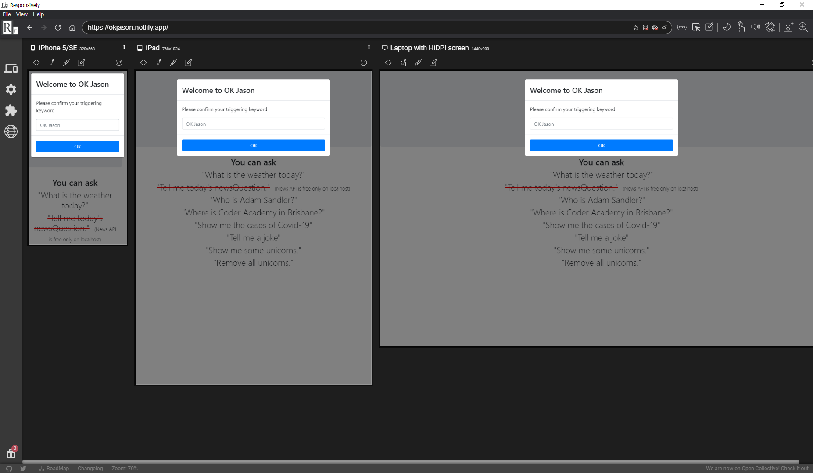
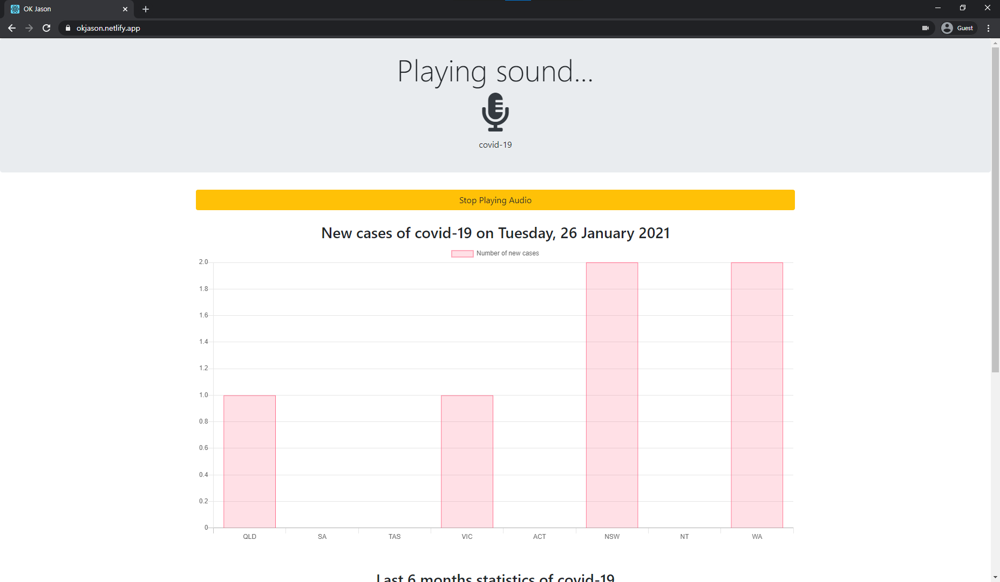

<h1 align="center"> OK Jason
</h1>

# Table of Contents

- [Deployed App Link](#Deployed-App-Link)
- [GitHub repository link](#GitHub-Repository-Link)
- [Purpose](#Purpose)
- [Tech stack](#Tech-Stack)
- [Screenshots](#Screenshots)

   

# Deployed App Link
Deployed app link: https://okjason.netlify.app

[Go back](#table-of-contents)   

# GitHub repository link

GitHub repository link: https://github.com/jasonkim7288/react_ok_jason

[Go back](#table-of-contents)   

# Purpose
'OK Jason' is a browser-based speech recognition service. It is similar to 'OK Google' or 'Siri', but the difference is that 'OK Jason' is a browser based application, so you can experience an AI speaker wherever the Chrome browser is installed in any desktop, tablet, or mobile device. You can change the trigger word other than 'OK Jason' such as 'OK Thomas', 'Siri', or 'Hi John'. The current services are Covid-19 statistics in Australia, Google Map, Weather, Wikipedia, Dad jokes, and displaying unicorns icons.

[Go back](#table-of-contents)   

# Tech stack
* React JS: Front-end web application library
* speak-tts: Text To Speech module to read out loud as a response.
* aws-sdk: AWS S3 Bucket to access the latest update for the Covid-19 statistics in Australia.
* chart.js: visualised graph module to display statistics.
* axios: a JavaScript library for making HTTP requests using node.js
* bootstrap: CSS framework to make UI prettier and quicker
* moment: Date format handling module
* react-google-maps: react module to display Google maps

[Go back](#table-of-contents)   

## Screenshots

[Go back](#table-of-contents)   
